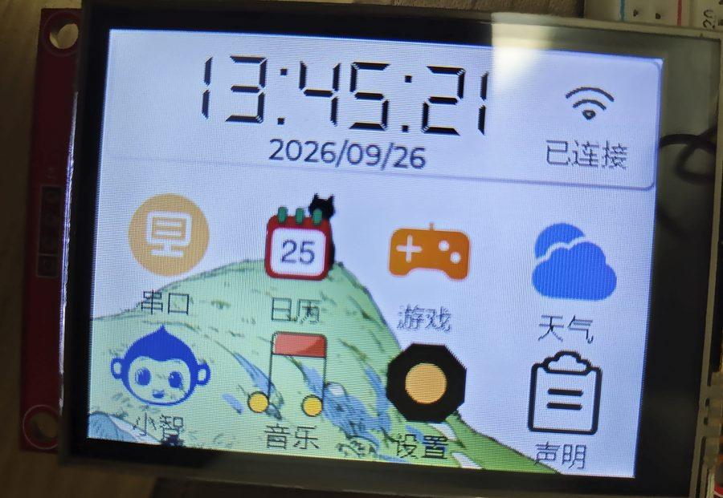
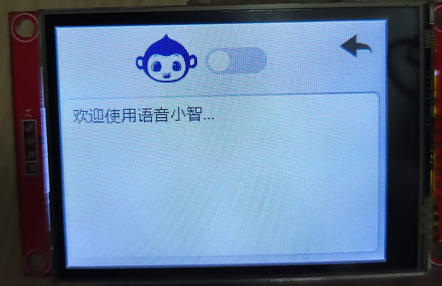
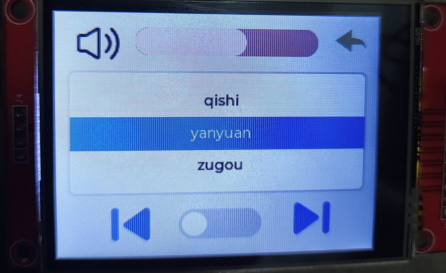
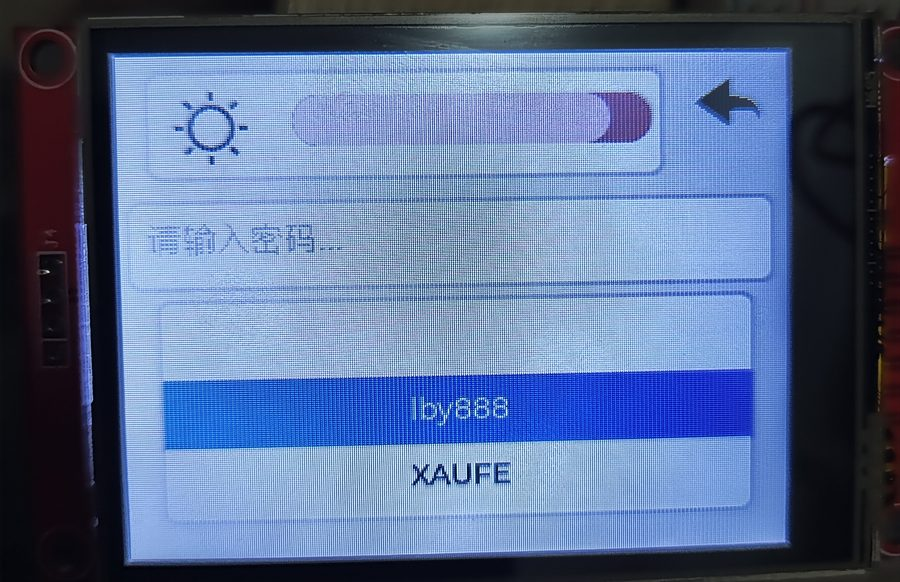
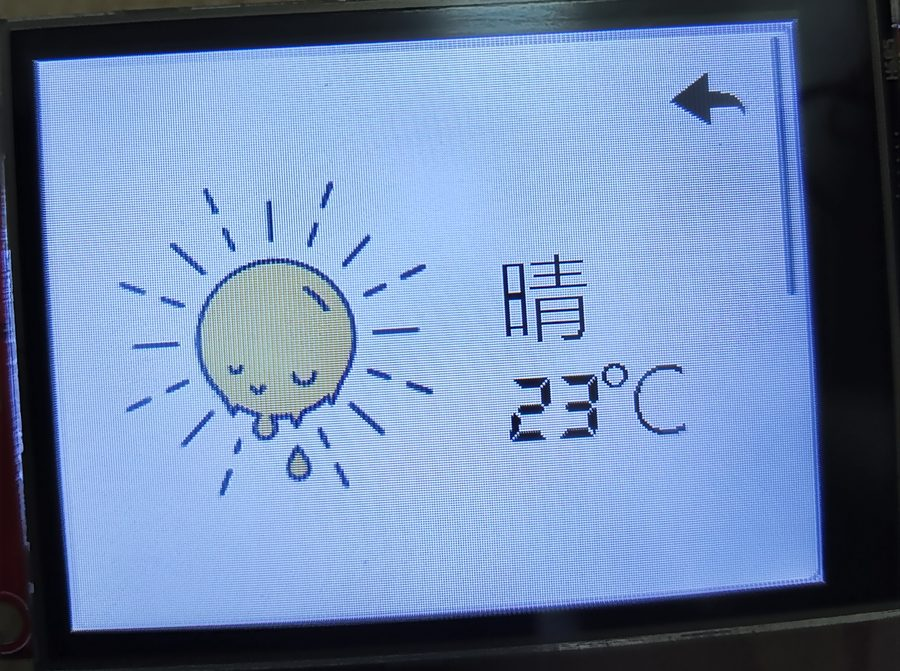
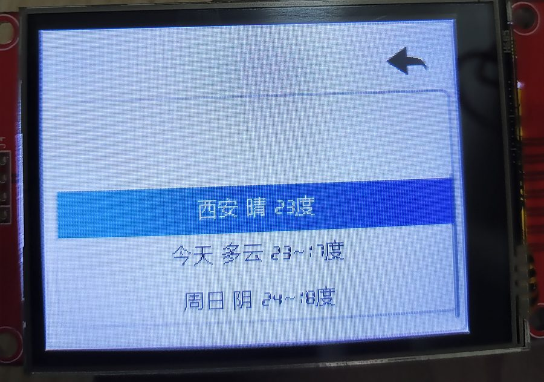
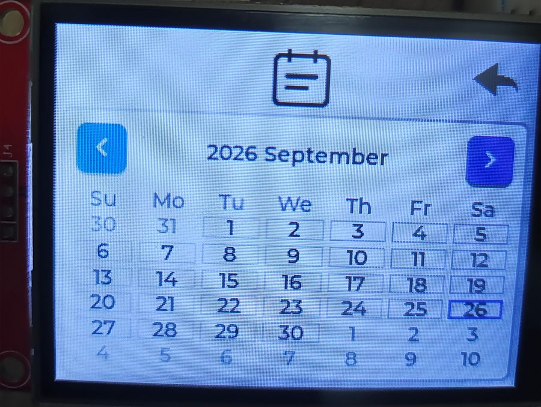
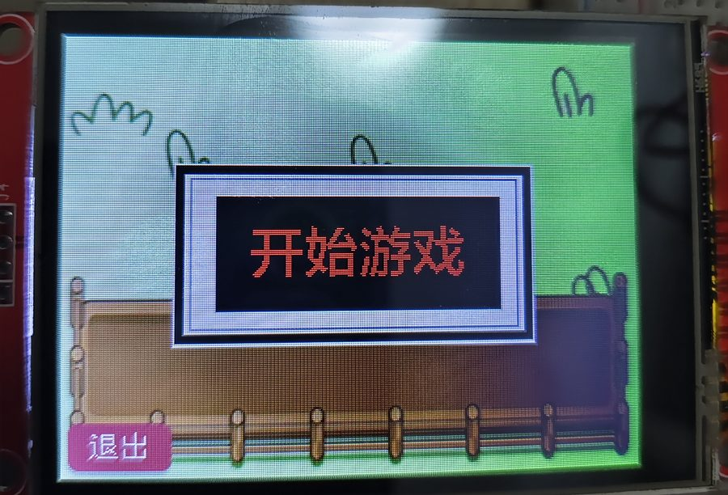
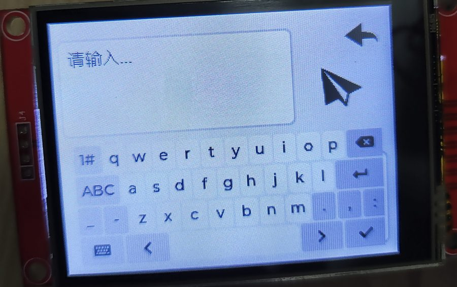
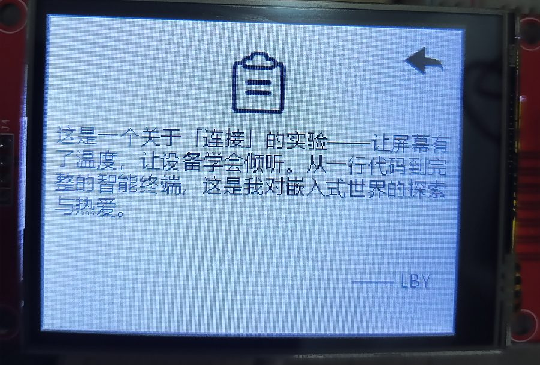

# 多功能智能终端 (Smart Device LLL)

基于 **ESP32-S3** 的多功能智能终端。一块 320×240 触摸屏 + 语音助手 + SD 卡音乐播放器 + 天气/时钟/日历，全部跑在 FreeRTOS 上。


---

## 目录

- [界面预览](#界面预览)
- [功能特性](#功能特性)
- [硬件清单](#硬件清单)
- [接线说明](#接线说明)
- [软件架构](#软件架构)
- [快速开始](#快速开始)
- [使用说明](#使用说明)
- [项目结构](#项目结构)
- [已知限制](#已知限制)

---

## 界面预览

| 主页 | 小智 · 语音助手 | 音乐播放器 |
| :---: | :---: | :---: |
|  |  |  |

| 设置 · 配网 | 天气 · 实况 | 天气 · 预报 |
| :---: | :---: | :---: |
|  |  |  |

| 日历 | 游戏 · 羊了个羊 | 串口 |
| :---: | :---: | :---: |
|  |  |  |

| 声明 |
| :---: |
|  |

---

## 功能特性

| 页面 | 功能 |
| --- | --- |
| 🏠 主页 | 实时时钟 + 日期，WiFi 连接状态，八个功能入口 |
| 🤖 小智 | 语音助手：按住开关说话 → 百度语音识别 → 大模型问答 → TTS 播报 |
| 🎵 音乐 | 扫描 SD 卡根目录的 MP3，滚轮选曲、播放/暂停、上一首/下一首、音量调节 |
| ⚙️ 设置 | WiFi 扫描配网（滚轮选热点 + 软键盘输密码）、屏幕亮度调节 |
| 🎮 游戏 | 「羊了个羊」消除小游戏（来自 [lvgl-games](https://github.com/CaddonThaw/lvgl-games)） |
| 📅 日历 | LVGL 日历控件，自动定位到当天，可翻月 |
| 🌤 天气 | 心知天气 API，实时天气 + 未来 4 天预报，5 分钟自动刷新 |
| 📄 声明 | 项目说明页 |
| 🔌 串口 | 与 PC 双向串口通信，屏幕软键盘发送消息，接收区显示回传内容 |

**技术要点**

- **8 个 FreeRTOS 任务**并行调度，LVGL 与网络/音频/SD 完全解耦
- **跨任务 UI 更新**统一走 `lv_async_call()`，避免 LVGL 线程安全问题
- **SD 总线互斥锁**（普通互斥量），三处并发访问 SD 互不打架
- **SPI 总线分离**：屏幕走 SPI2，SD 卡走 SPI3（HSPI），两者不抢总线
- **双 I2S 通道**：麦克风输入走 I2S0，功放输出走 I2S1

---

## 硬件清单

| 元件 | 型号 | 数量 | 说明 |
| --- | --- | --- | --- |
| 主控 | **ESP32-S3-DevKitC-1** (N16R8) | 1 | 16MB Flash + 8MB **Octal PSRAM** |
| 屏幕 | **ILI9341** 2.8" SPI TFT，320×240 | 1 | 带 **XPT2046** 电阻触摸 |
| 麦克风 | **INMP441** | 1 | I2S 数字麦克风 |
| 功放 | **NS4168** | 1 | I2S 数字功放，接 4Ω/8Ω 喇叭 |
| 喇叭 | 4Ω 3W 或 8Ω 1W | 1 | — |
| SD 卡模块 | MicroSD SPI 转接板 | 1 | 独立 SPI 总线 |
| SD 卡 | MicroSD 卡（FAT32） | 1 | 存放 MP3 |

> ⚠️ **务必选 Octal PSRAM（R8）版本**。`platformio.ini` 里配置了 `memory_type = qio_opi`，换成 Quad PSRAM（R2）的板子会启动失败。

---

## 接线说明

### 整体连线框图

```
                        ┌──────────────────────────────┐
                        │      ESP32-S3-DevKitC-1      │
                        │         (N16R8)              │
                        └──────────────────────────────┘
                                       │
        ┌──────────────────┬───────────┼───────────┬──────────────────┐
        │                  │           │           │                  │
   ┌────┴─────┐      ┌─────┴────┐ ┌────┴────┐ ┌────┴─────┐      ┌─────┴──────┐
   │ ILI9341  │      │ XPT2046  │ │ INMP441 │ │  NS4168  │      │  MicroSD   │
   │  屏幕    │      │  触摸    │ │  麦克风 │ │  功放    │      │   模块     │
   └──────────┘      └──────────┘ └─────────┘ └────┬─────┘      └────────────┘
    SPI2 (共用)        SPI2 独立      I2S0 输入     I2S1 输出        SPI3 (HSPI)
                                                      │
                                                   ┌──┴──┐
                                                   │喇叭 │
                                                   └─────┘
```

### 1. ILI9341 显示屏 + XPT2046 触摸（SPI2，与屏幕共用）

| ILI9341 / XPT2046 引脚 | ESP32-S3 GPIO | 说明 |
| :--- | :---: | :--- |
| VCC | **3V3** | 逻辑供电 |
| GND | **GND** | — |
| CS | **4** | 屏幕片选 |
| RESET | **5** | 屏幕复位 |
| DC / RS | **6** | 数据/命令选择 |
| MOSI / SDI | **7** | SPI 数据 |
| SCK / CLK | **15** | SPI 时钟 |
| MISO / SDO | **17** | SPI 数据回读 |
| LED / BL | **16** | 背光，接 **LEDC PWM** 调亮度 |
| T_CLK | **15** | 触摸时钟（与屏幕 SCK 共用） |
| T_CS | **8** | 触摸片选 |
| T_DIN | **7** | 触摸数据（与屏幕 MOSI 共用） |
| T_DO | **17** | 触摸数据（与屏幕 MISO 共用） |
| T_IRQ | 不接 | 代码用轮询，不用中断 |

> 屏幕和触摸共用 SCK/MOSI/MISO 三条线，靠 **CS 片选**区分（屏幕 CS=4，触摸 CS=8）。

### 2. INMP441 麦克风（I2S0，输入）

| INMP441 | ESP32-S3 GPIO | 说明 |
| :--- | :---: | :--- |
| VDD | **3V3** | ⚠️ 只能接 3.3V |
| GND | **GND** | — |
| SCK / BCLK | **11** | 位时钟 `I2S_SCK` |
| WS / LRCL | **13** | 声道时钟 `I2S_WS` |
| SD / DOUT | **12** | 数据输出 `I2S_SD` |
| L/R | **GND** | 接地选**左声道** |
| CHIPEN | 接 3V3 或不接 | 默认使能 |

> `L/R` 悬空会随机选声道，务必接地。录音质量差时优先检查这里和电源退耦。

### 3. NS4168 功放（I2S1，输出）

| NS4168 | ESP32-S3 GPIO | 说明 |
| :--- | :---: | :--- |
| VDD | **5V** | ⚠️ 强烈建议接 5V，见下方提示 |
| GND | **GND** | — |
| BCLK | **40** | 位时钟 `I2S_BCLK` |
| LRC / LRCLK | **41** | 声道时钟 `I2S_LRC` |
| DIN | **39** | 数据输入 `I2S_DOUT` |
| /SD 或 CTRL | 不接 | 使能/静音脚，模块默认使能；本项目不用它做静音 |
| SPK+ / SPK− | 接喇叭 | 差分输出，**不要**接地 |

> 不同批次的 NS4168 模块丝印叫法不一致（`/SD`、`CTRL`、`SPK±`、`OUT±` 都见过），以手上模块为准，认准 VDD / GND / BCLK / LRC / DIN 五个就行。
>
> **供电提示**：本项目把音量上限锁在 `AUDIO_VOLUME_MAX = 10`（库范围 0~21），原因就是 3.3V 供电余量不足 —— 音量开大时功放会把 3.3V 轨拉垮，连带 SD 卡掉线。把功放 VDD 接到 **5V** 可以显著改善。

### 4. MicroSD 卡模块（SPI3 / HSPI，独立）

| SD 模块 | ESP32-S3 GPIO | 说明 |
| :--- | :---: | :--- |
| VCC | **3V3** | 部分模块支持 5V，优先 3.3V |
| GND | **GND** | — |
| CS | **10** | 片选 `SD_CS` |
| MOSI | **47** | `SD_MOSI` |
| MISO | **18** | `SD_MISO` |
| SCK | **21** | `SD_SCLK` |

> SD 卡**单独挂在 SPI3**，和屏幕的 SPI2 物理隔离。这样音频解码读卡时不会和 LVGL 刷屏抢总线，是画面不卡顿的关键。

### 引脚占用总览

```
GPIO  4  ── TFT_CS          GPIO 18 ── SD_MISO
GPIO  5  ── TFT_RST         GPIO 21 ── SD_SCLK
GPIO  6  ── TFT_DC          GPIO 39 ── I2S_DOUT   (功放 DIN)
GPIO  7  ── TFT_MOSI/T_DIN  GPIO 40 ── I2S_BCLK   (功放 BCLK)
GPIO  8  ── TOUCH_CS        GPIO 41 ── I2S_LRC    (功放 LRC)
GPIO 10  ── SD_CS           GPIO 43 ── UART TX    (USB 串口，勿占用)
GPIO 11  ── I2S_SCK         GPIO 44 ── UART RX    (USB 串口，勿占用)
GPIO 12  ── I2S_SD          GPIO 33~37 ── Octal PSRAM 占用，勿用
GPIO 13  ── I2S_WS
GPIO 15  ── TFT_SCLK/T_CLK
GPIO 16  ── TFT_BL (背光 PWM)
GPIO 17  ── TFT_MISO/T_DO
GPIO 47  ── SD_MOSI
```

---

## 软件架构

### FreeRTOS 任务

全部定义在 `src/tasks/tasks.cpp`，一个文件看完。

| 任务 | 优先级 | 栈 (字节) | 周期 | 职责 |
| :--- | :---: | :---: | :--- | :--- |
| `audio_task` | 5 | 8192 | 1 ms | 音频解码播放，执行播放/暂停/音量/TTS 请求 |
| `weather_task` | 5 | 4800 | 5 min | 拉取天气 API，请求刷新天气页 |
| `sd_task` | 4 | 4096 | 一次性 | 开机挂载 SD 卡并扫曲目，干完自己 `vTaskDelete` |
| `xiaozhi_task` | 4 | 12288 | 1 ms | 语音助手对话（开关打开时才跑） |
| `ui_task` | 3 | 8192 | 1 ms | `lv_timer_handler()` + 时钟/播放开关同步 |
| `wifi_task` | 3 | 4500 | 50 ms | 扫描热点、连接 WiFi、刷新状态文字 |
| `time_task` | 3 | 4500 | 1 s | 刷新主页时钟日期 |
| `uart_task` | 3 | 4500 | 1 s | 串口收发 |

任务体一律是"死循环 + 调一个模块函数"，逻辑都在模块里。改调度策略不用动业务代码。

> **栈的单位是字节**，不是原生 FreeRTOS 的字（ESP-IDF 的 `xTaskCreate`
> 收字节，见 `task.h` 的注释 "differs from vanilla FreeRTOS"）。两个大栈
> 有实测依据，别凭感觉改小：
>
> - `xiaozhi_task` 要 12K —— 内部有两次 HTTPS（百度 token + MiniMax），
>   一次 TLS 握手在十几 KB 级别，且发生在 7 层深的调用栈里。给 4500 时
>   实测只剩 **148 字节**，会随机崩。
> - `ui_task` 要 8K —— `lv_timer_handler()` 的重绘递归不浅，给 4500 时
>   实测剩 **872 字节**。
>
> 量栈用 `uxTaskGetStackHighWaterMark()`（返回字节，且是历史最小值，
> 要在最坏情况跑过之后再读）。

### 跨任务通信

关键点：**共享资源各自只有一个所有者**，别人想用得发请求。

**1. 界面 —— 只有 `view/` 能碰控件**

LVGL 不是线程安全的，只有 `ui_task` 能碰控件。别的任务要改界面时，
调 `view/ui_view.h` 里的语义化接口，函数内部自己 `lv_async_call` 投给 `ui_task`：

```cpp
// wifi_task 里更新主页的 WiFi 状态文字
ui_view_wifi_state(cur_status == WL_CONNECTED);

// ui_view.cpp 内部：投给 ui_task，回调里才真正操作控件
void ui_view_wifi_state(bool connected) { /* ... lv_async_call(cb, txt) ... */ }
```

调试用的判据：`grep -rn "lv_" src/` 的结果里，除了 `view/`、`ui_events.c`
（SquareLine 生成的事件回调）、`screen.cpp`（LVGL 移植层）和 `tasks.cpp`
里的 `lv_timer_handler()`，不该出现在别处。

**2. 音频 —— 只有 `audio_task` 能碰 `Audio` 对象**

`Audio` 不是线程安全的，但音乐播放和小智的语音回答都要用它。所以统一发请求，
由 `audio_task` 独占执行：

```cpp
// UI 回调 / 小智模块：只发请求，立刻返回
audio_request_play(idx, 0);
audio_request_tts(url);

// audio_task 每轮取走请求并执行，只有这里出现 audio.xxx()
void audio_process_requests(void) { /* 取走 g_audio_cmd → connecttoSD() */ }
```

**3. 状态 —— 集中在 `state/app_state.h`**

`g_wifi_scan_req`、`g_wifi_connect_req`、`g_audio_cmd`、`g_xiaozhi_ask` 等
`volatile` 标志位，生产者只置位，消费者只清位。每个变量在头文件里都注明了
谁写谁读。

需要保护的缓冲区（WiFi 的 ssid/pwd）用 `g_wifi_cfg_mutex`：一边是
`strncpy` 写、一边要 `strlen` 读，不加锁会读到改了一半的内容。

### SD 卡并发保护

音频播放、音乐列表扫描、音乐加载三处会同时访问 SD 卡，用互斥锁保护（`src/sd_card.h`）：

```cpp
SD_LOCK();                          // xSemaphoreTake
bool ok = audio.connecttoSD(path);  // 整段持有锁
SD_UNLOCK();
```

这是**普通**互斥量。全项目的用点都是平铺的单层临界区，没有嵌套获取，
所以不需要递归锁——但代价是**同一任务里再嵌套一次 `SD_LOCK()` 就是死锁**
（自己等自己）。以后要在持锁函数里调另一个也会加锁的函数时，把锁提到
最外层。

注意这条锁**只覆盖"打开文件"这一下**。真正的持续读盘是 `audio.loop()`
里的 `audiofile.read()`，它不持锁 —— 靠的是"扫描总发生在播放之前"这个
时序，而不是锁本身。改动音乐页流程时留意这点。

### SD 卡为什么这么简单

SD 卡挂不上、掉线，**根因是供电不足**（Wi-Fi 发射的电流尖峰把 3.3V 拉垮），
属于硬件问题。所以软件这边刻意**不加重试、不轮询、不检测**：

```cpp
void sd_task(void *pvParameters) {
    g_sdcard.init();        // 挂一次
    vTaskDelete(NULL);      // 成败就此定论，挂不上就按复位键
}
```

这不是偷懒。之前试过自动重挂载、掉线检测、僵尸播放看门狗，结果要么
没用（驱动层的 `cardType()` 返回的是缓存字段，检测不到掉线），要么
帮倒忙（在 `audio_task` 这个最高优先级任务里以 1ms 周期读卡，卡死时
把 IDLE 饿死，触发 TASK_WDT 重启）。

### 排查"突然重启"

现象都是"用着用着回到主页"，但两种成因修法完全相反，得先分清：

- **崩溃重启**：串口会先打出 `Guru Meditation` 和一堆回溯，往上翻就能定位。
- **掉电／brownout 重启**：串口直接从头开始，崩之前没有任何异常输出。

前者查代码，后者查硬件（供电、退耦、接线）——概率上本项目几乎都是后者。

> `main.cpp` 早期启动时会打印 `esp_reset_reason()`，一眼就能区分这两者。
> 现已按需求移除，要复现的话把那段加回 `setup()` 开头就行。

---

## 快速开始

### 1. 准备环境

- [PlatformIO](https://platformio.org/install)（VS Code 插件或 CLI 均可）
- 一块 **ESP32-S3-DevKitC-1 (N16R8，带 Octal PSRAM)**

### 2. 克隆并配置凭据

```bash
git clone https://github.com/2058327624-crypto/Smart_device_LLL
cd Smart_device_LLL

# 从模板生成私有凭据文件
cp include/secrets.example.h include/secrets.h
```

然后编辑 `include/secrets.h`，填入你自己的值：

| 宏 | 用途 | 获取方式 |
| :--- | :--- | :--- |
| `WIFI_SSID` / `WIFI_PASSWORD` | WiFi 连接 | 注意必须在 **2.4GHz** 频段 |
| `BAIDU_APP_ID` / `BAIDU_APP_KEY` / `BAIDU_SECRET_KEY` | 百度语音识别 + 合成 | [百度智能云](https://console.bce.baidu.com/ai/#/ai/speech/app/list) 创建「语音技术」应用 |
| `SENIVERSE_API_KEY` | 心知天气 | [心知天气控制台](https://console.seniverse.com/) |
| `WEATHER_CITY` | 天气城市 | 拼音，如 `xian`、`beijing` |
| `MINIMAX_API_KEY` | 小智的回答生成 | [MiniMax 开放平台](https://platform.minimaxi.com/) → 账户管理 → 接口密钥 |

> `include/secrets.h` 已在 `.gitignore` 中，**不会**被提交。`platformio.ini` 通过 `-include secrets.h` 全局注入这些宏，所以不用改任何 `.cpp`。

**关于 `MINIMAX_API_KEY`**：`baidu-xiaozhi` 库把 MiniMax key 写死在它自己的头文件里，而且没有 `#ifndef` 保护，`-D` 覆盖不了、只能改文件——可库文件在 `.pio/libdeps/` 下，删 `.pio` 或 `pio pkg update` 就会丢失，丢了以后**语音助手会静默失效**（界面正常、开关能开，但永远返回 `<error>`，只在串口报错）。

所以本项目用 `scripts/patch_minimax.py` 在编译前自动把这个 key 注入进去，你只需要填 `secrets.h`，不用手改库文件。脚本是幂等的，key 没变时不会重复写盘。

### 语音助手的数据流

```
麦克风(INMP441) ──I2S0──▶ 百度语音识别 ──▶ MiniMax 大模型 ──▶ 百度语音合成 ──▶ 功放(NS4168)
                            BAIDU_*_KEY      MINIMAX_API_KEY      BAIDU_*_KEY
```

四段链路任意一个 key 没配好，都会表现为「开关能开但没反应」，排查时先看串口日志。

### 3. 编译烧录

```bash
pio run              # 编译
pio run -t upload    # 烧录（首次建议先按住 BOOT 再点 RST 进下载模式）
pio device monitor   # 查看串口日志（115200 波特率）
```

### 4. 准备 SD 卡

把 MP3 文件**放在 SD 卡根目录**（不递归子目录），格式化为 **FAT32**：

```
SD卡根目录/
├── 晴天.mp3
├── 稻香.mp3
└── 起风了.mp3
```

最多识别 **32 首**。文件名（含 `.mp3` 后缀）最长 **62 字符**——超了会被截断，可能连后缀一起截掉，那首就点不响；列表里显示的歌名则截到 39 字符。

---

## 使用说明

| 操作 | 说明 |
| :--- | :--- |
| **切换页面** | 主页八个图标点击进入，各页右上角返回图标回主页 |
| **配网** | 设置页 → 点 SSID 输入框 → 滚轮选热点 → 弹键盘输密码 → 点 ✓ |
| **放音乐** | 音乐页 → 滚轮选曲（选中即加载）→ 打开播放开关出声音 |
| **语音助手** | 小智页 → 打开开关 → 对着麦克风说话 → 自动识别并语音回答 |
| **看天气** | WiFi 连上后自动拉取，5 分钟刷新一次 |
| **串口通信** | 串口页 → 软键盘输入 → 发送到 PC；PC 发来的内容显示在接收区 |

> 串口页和 `pio device monitor` 共用同一个 UART0，调试时注意别互相干扰。

---

## 项目结构

```
Smart_device_LLL/
├── platformio.ini              # 构建配置：引脚宏、库依赖
├── .gitignore                  # 已忽略 secrets.h / .pio / .claude
├── include/
│   ├── lv_conf.h               # LVGL 配置
│   ├── secrets.example.h       # 凭据模板
│   └── secrets.h               # 真实凭据（不进仓库）
├── picture/                    # README 用的界面截图
├── scripts/
│   ├── patch_minimax.py        # 编译前自动注入 MiniMax key 到 baidu-xiaozhi 库
│   └── gen_weather_icons.py    # 把天气图标 PNG 转成 LVGL C 数组
└── src/
    ├── main.cpp                # setup()：初始化顺序
    ├── state/                  # 【状态层】跨模块共享的变量都在这儿
    │   └── app_state.cpp/.h    # 想知道"项目有哪些状态"看这一个文件
    ├── view/                   # 【视图层】唯一允许碰 LVGL 控件的地方
    │   ├── ui_view.cpp/.h      # 语义化接口，内部统一 lv_async_call
    │   └── weather_icons.c/.h  # 天气图标 C 数组（脚本生成）
    ├── tasks/                  # 【任务层】8 个 FreeRTOS 任务
    │   └── tasks.cpp/.h        # 一个文件看全"谁在跑、跑多快、干什么"
    ├── screen.cpp/.h           # 【硬件层】TFT 驱动 + LVGL 移植
    ├── sd_card.cpp/.h          # 【硬件层】SD 卡挂载 + 互斥锁
    ├── My_Wifi.cpp/.h          # 【业务层】WiFi 连接、扫描、NTP 对时
    ├── My_audio.cpp/.h         # 【业务层】音频播放、MP3 扫描、请求队列
    ├── My_xiaozhi.cpp/.h       # 【业务层】语音助手状态机
    ├── weather.cpp/.h          # 【业务层】心知天气 API（只取数据，不画界面）
    └── ui/                     # SquareLine Studio 生成的 LVGL 界面
        ├── ui.c/.h             # 界面总入口 + 控件句柄   ⚠ 生成物，别手改
        ├── ui_events.h         # ⚠ 生成物，重导出会覆盖
        ├── ui_events.c         # 事件回调（手写，不受重导出影响）
        ├── screens/            # 9 个页面
        ├── components/ fonts/ images/
        ├── filelist.txt        # SquareLine 源文件清单
        └── CMakeLists.txt
```

### 分层约定

改动前先确认改的是哪一层：

| 层 | 目录 | 规矩 |
| :--- | :--- | :--- |
| 状态层 | `state/` | 只放跨模块的变量，模块内部的静态变量别往里搬。每个变量写清谁写谁读 |
| 视图层 | `view/` | **只有这里能调 `lv_xxx`**。任务和业务模块改界面一律调 `ui_view_*()` |
| 任务层 | `tasks/` | 只负责"什么时候反复调一次"，逻辑在业务模块里 |
| 硬件层 | `screen` `sd_card` | 驱动和移植，不掺业务 |
| 业务层 | `My_*` `weather` | 只管自己的事，不碰控件、不 include `ui/ui.h` |

两个容易踩的点：

1. **`src/ui/` 下的文件是 SquareLine 生成的**（`ui.h`/`ui.c`/`ui_helpers.*`/`screens/`/`fonts/`/`images/`/`ui_events.h`）。工程里 `uiExportFolderPath` 写死了这个路径，所以**目录不能改**。手写的东西一律放外面。

2. **`ui_events.h` 每次导出都会被整个重写**，内容只保留 SquareLine 工程
   Events 面板里配过的回调声明（`Game_yang`、`Keyboard_Show`、`switch_xiaozhi_cb`
   这些）。里面另外手写过的声明（`music_page_on_show`、`music_on_card_recovered`
   之类）导出后就没了 —— 现在没人引用它们，丢了也不影响编译，但**以后要在别处
   调一个没在 Events 面板注册过的回调时，得把声明挪到 `view/` 下的手写头文件**，
   否则每次导出都要重新补一遍。

### 依赖库

由 PlatformIO 自动安装（见 `platformio.ini`）：

| 库 | 版本 | 用途 |
| :--- | :--- | :--- |
| `lvgl/lvgl` | 8.3.11 | 图形界面 |
| `bodmer/TFT_eSPI` | 2.5.0 | ILI9341 驱动 |
| `bblanchon/ArduinoJson` | ^6.21.4 | 天气 JSON 解析 |
| `esphome/ESP32-audioI2S` | 2.0.6 | MP3 解码播放 |
| `gilmaimon/ArduinoWebsockets` | ^0.5.3 | 语音助手通信 |
| `plageoj/UrlEncode` | ^1.0.1 | 天气 URL 编码 |
| `CaddonThaw/baidu-xiaozhi` | git | 百度语音识别 + 合成封装 |
| `CaddonThaw/lvgl-games` | git | 羊了个羊小游戏 |

---

## 已知限制

- **MP3 只扫根目录**，不支持子文件夹（见 `music_scan()` 注释）
- **最多 32 首**曲目，超出部分不显示
- **音量上限锁在 10/21**，是供电限制而非软件限制，改 `AUDIO_VOLUME_MAX` 前请先改善供电
- **SD 卡掉线**：如果拔卡或供电不足，`sd_task` 会打印告警，但**不会自动重新挂载**
- **天气 API 免费版**仅支持部分城市，且每日调用次数有限
- **语音助手**依赖百度 + MiniMax 在线 API，断网不可用；且与音乐播放互斥（播放音乐时语音助手暂停）
- **首次上电** WiFi 连接是阻塞的（最多 10 秒），期间界面不响应

---

## 致谢

- UI 由 [SquareLine Studio](https://squareline.io/) 生成
- [lvgl-games](https://github.com/CaddonThaw/lvgl-games) 提供小游戏
- [baidu-xiaozhi](https://github.com/CaddonThaw/baidu-xiaozhi) 提供语音能力封装

## 许可

本项目仅供学习交流使用。第三方库版权归各自作者所有。
